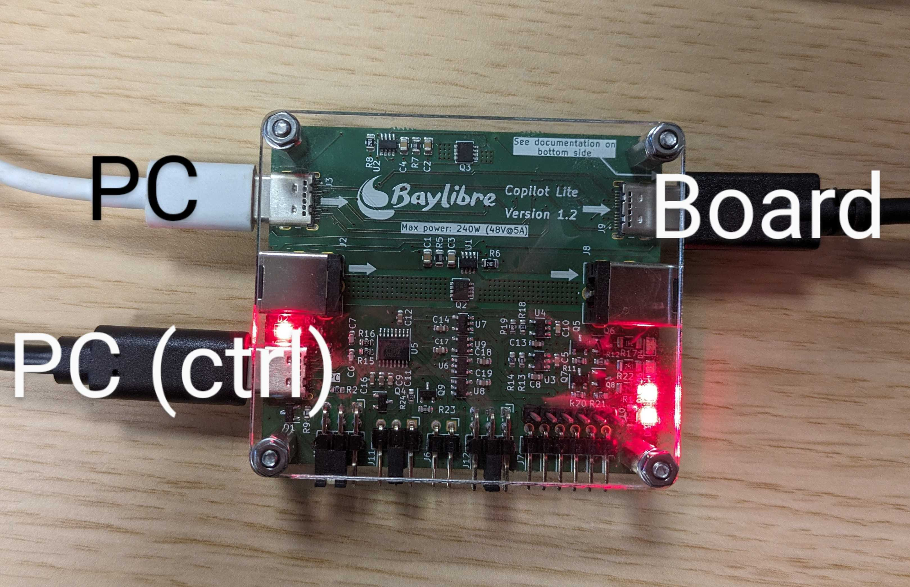

.. Copilot documentation master file, created by
   sphinx-quickstart on Tue Dec 12 19:07:24 2023.
   You can adapt this file completely to your liking, but it should at least
   contain the root `toctree` directive.

Welcome to Copilot's documentation!
===================================

Copilot is a small device to control power and UART of a Device Under Test. It
is connected to a PC with a single USB connection and another USB or Jack
connection for power switching.

Features
--------

 - Power switching with a simple command available in many distributions:

   .. code-block:: bash

     gpioset /dev/copilot/by-id/${ID_USB_SERIAL_SHORT}/gpiochip 0=1

 - Switch power up to 48V/5A via USB-C or Power Jack
 - Connect to DUT UART on 1.8/3.3/5V
 - Provide 4 additional GPIOs for other DUT related tasks

.. toctree::
   :maxdepth: 2
   :caption: Documentation:

   getting-started

Indices and tables
==================

* :ref:`genindex`
* :ref:`modindex`
* :ref:`search`
